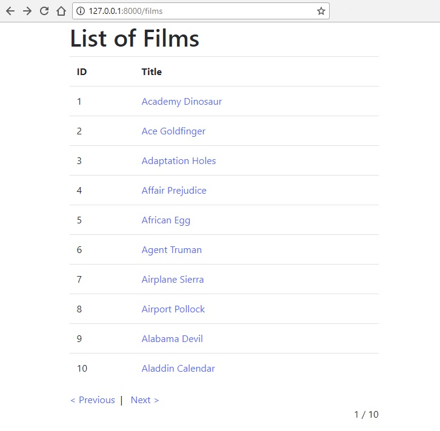
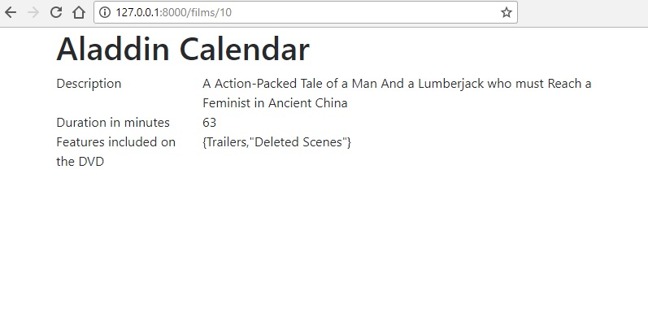

# Cvičenie 5 - PHP základy, Laravel

<a name="c5-priklady"></a>
## Príklady na precvičenie

### Základy PHP
Pozrite si [rýchlokurz PHP](/prednasky/PHP-rychlokurz/). Osvojte si syntax a základné konštrukcie jazyka PHP, na spúštanie PHP kódu môžete použiť aj [Write PHP online](http://www.writephponline.com/). Základné príklady nájdete aj na stránke [w3schools](https://www.w3schools.com/php/default.asp).

### Laravel - zoznam filmov
Vašou úlohou je s použitím rámca Laravel implementovať jednoduchý stránkovaný zoznam filmov s detailom.

* vytvorte si databázu v PostgreSQL s ľubovolným názvom

* vytvorte vo vytvorenej databáze tabuľku
```sql
CREATE TABLE films (
    id serial,
    title character varying(255) NOT NULL,
    description text,
    length smallint,
    special_features text[]);
```
* vložte do tabuľky [tieto záznamy](zdroje/films.sql)

V Laravel aplikácii si nakonfigurujte pripojenie na databázu. Vytvorte potrebné smerovanie (routing), controller-y a view-y.

Na požiadavku `/films` sa zobrazí zoznam filmov.
Zoznam bude obsahovať stránkovanie, pričom na jednej stránke bude 10 záznamov. Medzi stránkami sa bude dať prechádzať použitím odkazov *Previous* a *Next*, podobne ako ilustruje tento obrázok:



Stránkovanie je možné spraviť jednoducho pomocou [simplePaginate](https://laravel.com/docs/5.6/pagination):

```html
$filmsList = Film::orderBy('id', 'asc')->simplePaginate(10);
return view('films.index')->with('filmsList', $filmsList);
```

Pomocou [Paginator metód](https://laravel.com/docs/5.6/pagination#paginator-instance-methods) viete vo view jednoducho spraviť/vyskladať navigáciu medzi stránkami.

Po kliknutí na nadpis filmu sa zobrazí jeho detail, požiadavka `/films/{id_filmu}`.

Detail ilustruje tento obrázok:




