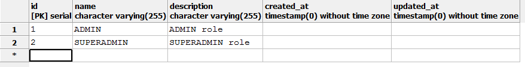
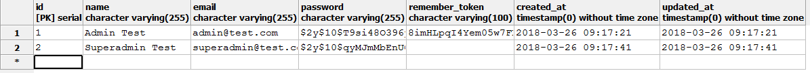

# Autentifikácia a autorizácia na základe role používateľa

## Cieľ
Uvažujme, že chceme poskytnúť určitý obsah (zobraziť vybrané stránky/sekcie) iba používateľom, ktorí majú určitú rolu (patria do nejakej skupiny, napr. administrátori). Našim cieľom je vytvoriť aparát, ktorý nám umožní kontrolovať rolu používateľa a na základe nej sprístupňovať obsah.  

Použijeme tieto základné technológie:

* Laravel 5+, [postup, ako vytvoriť nový Laravel projekt nájdete v 5. prednáške](/prednasky/zdroje/05-WT-web-architektury-laravel-uvod.pdf)
* Bootstrap 4
* PostgreSQL

Ak začíname v čistej Laravel aplikácii, vytvorme si najskôr databázu, napr. `testproject`. V koreňovom priečinku projektu v súbore `.env` nastavme pripojenie na databázu: 
```
DB_CONNECTION=pgsql
DB_HOST=127.0.0.1
DB_PORT=5432
DB_DATABASE=testproject
DB_USERNAME=ekoku
DB_PASSWORD=123456
```

Jednotlivé atribúty, ako napr. meno používateľa (`DB_USERNAME`) a heslo (`DB_PASSWORD`) si nastavíme podľa svojej konfigurácie.

## Vytvorenie základnej autentifikácie

V Laravel aplikácii vieme vytvoriť cez príkazový riadok (ďalej iba CLI) veľmi jednoducho základnú autentifikáciu vykonaním dvoch príkazov:
```
php artisan make:auth
php artisan migrate
```

Vytvorenú autentifikáciu otestujme v prehliadači, napr. registráciu používateľa na adrese `http://127.0.0.1:8000/register`
 
## Vytvorenie controllerov

Vytvorme `AdminController` a `SuperAdminController`:

```
php artisan make:controller AdminController
php artisan make:controller SuperAdminController
```

Do oboch controllerov pridajme tieto metódy `index`:

controller: `app/Http/Controllers/AdminController.php` 

```php
public function index()
{
    return view('admin.home');
}
```

controller: `app/Http/Controllers/SuperAdminController.php` 

```php
public function index()
{
    return view('superadmin.home');
}
```


## Vytvorenie šablón

V priečinku `/resources/views` vytvorme priečinky `admin` a `superadmin`.

V priečinku `admin` vytvorme súbor - šablónu - s názvom `home.blade.php`, ktorého obsah je takýto:

```html
@extends('layouts.app')
  
@section('content')
<div class="container">
    <div class="row">
        <div class="col-md-8 col-md-offset-2">
            <div class="panel panel-default">
                <div class="panel-heading">Admin dashboard</div>
   
                <div class="panel-body">
                    @if (session('status'))
                        <div class="alert alert-success">
                            {{ session('status') }}
                        </div>
                    @endif
  
                    Admin dashboard content.
                </div>
            </div>
        </div>
    </div>
</div>
@endsection
```

V priečinku `superadmin` vytvorme súbor - šablónu s názvom `home.blade.php`, ktorého obsah je:

```html
@extends('layouts.app')
  
@section('content')
<div class="container">
    <div class="row">
        <div class="col-md-8 col-md-offset-2">
            <div class="panel panel-default">
                <div class="panel-heading">Superadmin dashboard</div>
   
                <div class="panel-body">
                    @if (session('status'))
                        <div class="alert alert-success">
                            {{ session('status') }}
                        </div>
                    @endif
  
                    Superadmin dashboard content.
                </div>
            </div>
        </div>
    </div>
</div>
@endsection
```

## Nastavenie smerovania

Do súboru `routes/web.php` pridajme smerovanie:

```php
Route::get('/admin', 'AdminController@index');
Route::get('/superadmin', 'SuperAdminController@index');
```

## Vytvorenie modelu Role a nastavenie migrácií

Po vytvorení základenej autentifikácie máme v databáze vytvorenú tabuľku `users` a k nej zodpovedajúci model `app/User.php` Používateľ môže mať viacero rolí, rovnakú rolu môže mať viacero používateľov, ide teda o vzťah M:N.

Vytvorme model `Role` príkazom:
```
php artisan make:model Role -m
```

Okrem samotného modelu `app/Role.php` sa vytvoril aj migračný súbor `database/migrations/*_create_roles_table.php`. 

Pridajme v migračnom súbore do metódy `up()` tieto riadky:
```php
$table->string('name');
$table->string('description');
```

Ďalej potrebujeme vytvoriť väzobnú tabuľku medzi používateľom a rolou.

Vytvorme väzobnú tabuľku `role_user` cez migračný súbor, ktorý vytvoríme príkazom:
```
php artisan make:migration create_role_user_table
```  

V migračnom súbore pridajme do metódy `up()` tieto riadky (cudzie kľúče):
```php
Schema::create('role_user', function (Blueprint $table) {
    $table->increments('id');
    $table->integer('role_id')->unsigned();
    $table->integer('user_id')->unsigned();
    $table->timestamps();
});
```

Ďalej potrebujeme zadefinovať *many-to-many* vzťah medzi používateľom `User` a rolou `Role`.

Pridajme metódu `roles()` do modelu `app/User.php`:

```php
public function roles()
{
    return $this
        ->belongsToMany('App\Role')
        ->withTimestamps();
}
```

Pridajme tiež metódu `users()` do modelu `app/Role.php`:

```php
public function users()
{
    return $this
        ->belongsToMany('App\User')
        ->withTimestamps();
}
```

Spustime migráciu, čím vytvoríme želané tabuľky:
```
php artisan migrate
```

V databáze by mali byť tabuľky: `users`, `roles`, `role_user`, `migrations`,a `password_resets`. 

V tabuľke `roles` vytvorme dve role, *ADMIN* a *SUPERADMIN*.
```sql
INSERT INTO roles(name,description) VALUES ('ADMIN', 'ADMIN role');
INSERT INTO roles(name,description) VALUES ('SUPERADMIN', 'SUPERADMIN role');
```



V tabuľke `users` vytvorme dvoch používateľov *Admin Test* a *Superadmin Test*. Na zjednodušenie použijeme existujúci registračný formulár `/register`.



Vo väzobnej tabuľke `role_user` zadefinujme vzťahy medzi vytvorenými používateľmi a ich rolami. Používateľ *Admin Test* (id=1) má rolu *ADMIN* (id=1) a používateľ *Superadmin Test* (id=2) má rolu *SUPERADMIN* (id=2).

```sql
INSERT INTO role_user(role_id, user_id) VALUES (1, 1);
INSERT INTO role_user(role_id, user_id) VALUES (2, 2);
```

## Overenie role používateľa

Do modelu `app/User.php` pridajme tieto metódy:

```php
public function authorizeRoles($roles)
{
    if ($this->hasAnyRole($roles)) {
        return true;
    }
    abort(401, 'This action is unauthorized.');
}
  
public function hasAnyRole($roles)
{
    if (is_array($roles)) {
        foreach ($roles as $role) {
            if ($this->hasRole($role)) {
                return true;
            }
        }
    } else {
        if ($this->hasRole($roles)) {
            return true;
        }
    }
    
    return false;
}
  
public function hasRole($role)
{
    if ($this->roles()->where('name', $role)->first()) {
        return true;
    }
    return false;
}
```

Ak chceme overiť, či má používateľ danú rolu, použijeme metódu `hasRole`. Ak by sme chceli overiť, či má niektorú z rolí, použili by sme metódu `authorizeRoles`.

## Vytvorenie middleware CheckRole

Vytvorme middleware CheckRole príkazom:
```
php artisan make:middleware CheckRole
```

Vo vytvorenom súbore `app/Http/Middleware/CheckRole.php` doplňme do metódy `handle()` kontrolu, či má používateľ danú rolu:

```php
public function handle($request, Closure $next, $role)
{
    if (! $request->user()->hasRole($role)) {
        abort(401, 'This action is unauthorized.');
    }
    return $next($request);
}
```

Zaregistrujme vytvorený middleware `CheckRole` v súbore `app/Http/Kernel.php`:

```php
protected $routeMiddleware = [
    ...
    'role' => \App\Http\Middleware\CheckRole::class,
];
```

## Nastavenie controllerov

Na vykonanie kontroly autentifikácie a role, doplňme konštruktory v controlleroch `AdminController.php`  a `SuperAdminController.php` s volaniami na `auth` middleware a `role` middleware:

controller: `app/Http/Controllers/AdminController.php`  

```php
public function __construct()
{
    $this->middleware('auth');
    $this->middleware('role:ADMIN');
}
```

controller: `app/Http/Controllers/SuperAdminController.php`  

```php
public function __construct()
{
    $this->middleware('auth');
    $this->middleware('role:SUPERADMIN');
}
```

Hotovo!
Vyskúšajme sa prihlásiť `/login` ako používateľ *Admin Test*. Stránka `/admin` sa nám zobrazí, ale stránka `/superadmin` sa nezobrazí (This action is unauthorized.) - používateľ *Admin Test* nemá oprávnenie - nepatrí do role/skupiny *SUPERADMIN*.
